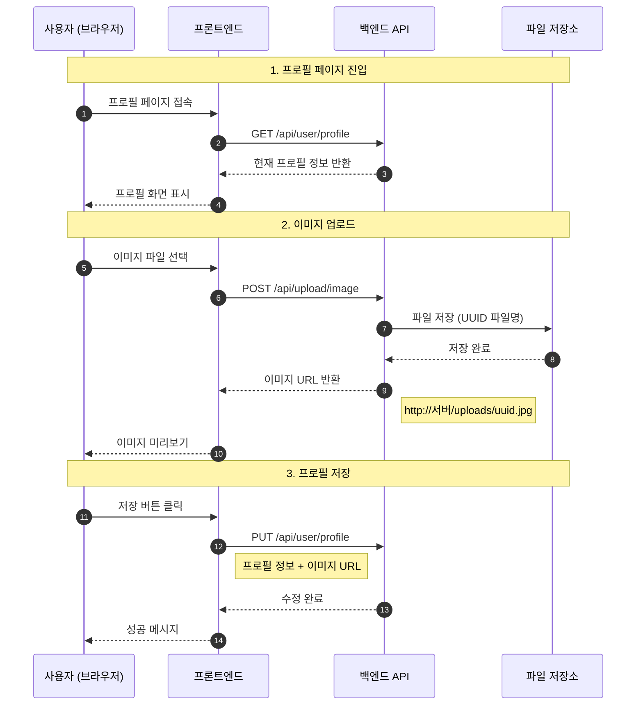
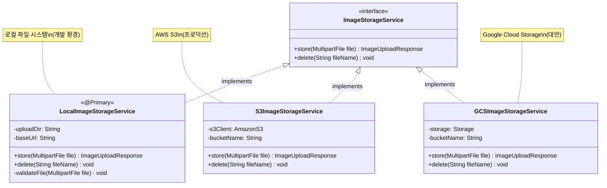
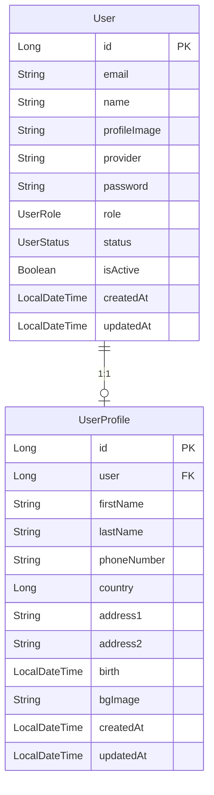
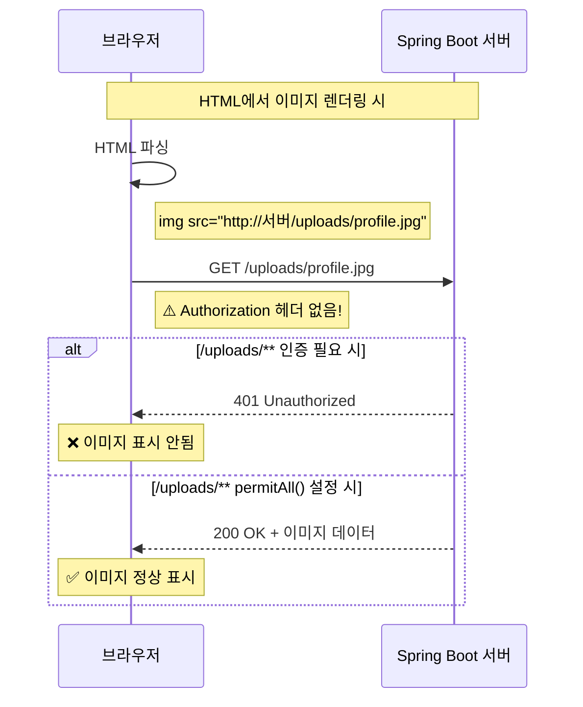
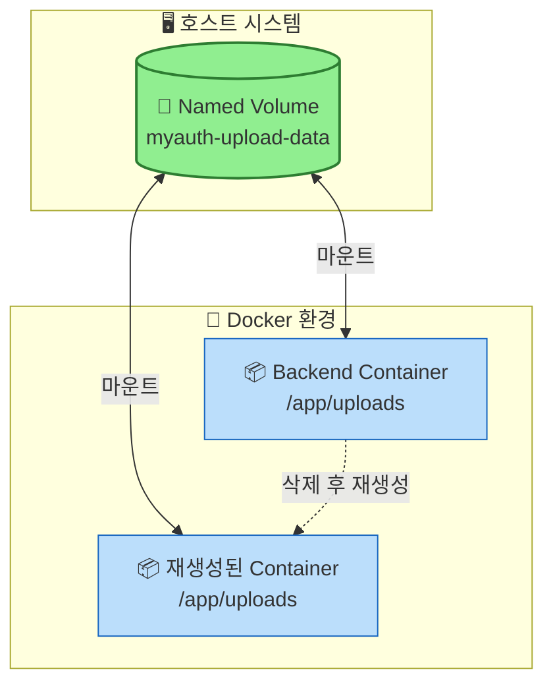

# 파일 업로드 및 프로필 수정 기능 구현 가이드

## 목차
1. [개요](#1-개요)
2. [아키텍처 설계](#2-아키텍처-설계)
3. [파일 업로드 구현](#3-파일-업로드-구현)
4. [프로필 조회/수정 구현](#4-프로필-조회수정-구현)
5. [Spring Security 설정](#5-spring-security-설정)
6. [Docker 볼륨 설정](#6-docker-볼륨-설정)
7. [프론트엔드 연동](#7-프론트엔드-연동)
8. [테스트](#8-테스트)

---

## 1. 개요

### 1.1 구현할 기능

| API | Method | 설명 |
|-----|--------|------|
| `/api/upload/image` | POST | 이미지 업로드 (프로필/배경) |
| `/api/upload/image/{fileName}` | DELETE | 이미지 삭제 |
| `/api/user/profile` | GET | 프로필 조회 |
| `/api/user/profile` | PUT | 프로필 수정 |
| `/uploads/{fileName}` | GET | 업로드된 이미지 접근 (공개) |

### 1.2 전체 흐름



---

## 2. 아키텍처 설계

### 2.1 인터페이스 기반 설계의 장점



**장점:**
- 저장소 변경 시 구현체만 교체하면 됨
- 테스트 시 Mock 구현체 사용 가능
- 의존성 역전 원칙(DIP) 준수

### 2.2 프로젝트 구조

```
src/main/java/com/example/myauth/
├── controller/
│   ├── ImageUploadController.java    # 이미지 업로드 API
│   └── UserController.java           # 프로필 조회/수정 API
├── service/
│   ├── ImageStorageService.java      # 인터페이스
│   ├── LocalImageStorageService.java # 로컬 저장소 구현체
│   └── UserService.java              # 사용자/프로필 서비스
├── dto/
│   ├── ImageUploadResponse.java      # 이미지 업로드 응답
│   ├── UserProfileUpdateRequest.java # 프로필 수정 요청
│   └── UserProfileUpdateResponse.java# 프로필 응답
├── entity/
│   ├── User.java                     # 사용자 엔티티
│   └── UserProfile.java              # 프로필 엔티티
└── config/
    ├── SecurityConfig.java           # 보안 설정
    └── WebMvcConfig.java             # 정적 리소스 매핑
```

---

## 3. 파일 업로드 구현

### 3.1 application.yaml 설정

```yaml
spring:
  # 파일 업로드 설정
  servlet:
    multipart:
      enabled: true              # 멀티파트 업로드 활성화
      max-file-size: 10MB        # 단일 파일 최대 크기
      max-request-size: 10MB     # 전체 요청 최대 크기
      file-size-threshold: 2KB   # 메모리에 저장할 임계값

# 커스텀 파일 설정
file:
  upload:
    dir: ${FILE_UPLOAD_DIR:./uploads}                              # 저장 경로
    base-url: ${FILE_UPLOAD_BASE_URL:http://localhost:9080/uploads} # 접근 URL
```

### 3.2 ImageUploadResponse DTO

```java
package com.example.myauth.dto;

import lombok.AllArgsConstructor;
import lombok.Builder;
import lombok.Data;
import lombok.NoArgsConstructor;

/**
 * 이미지 업로드 응답 DTO
 * 업로드된 파일의 정보를 클라이언트에게 반환
 */
@Data
@Builder
@NoArgsConstructor
@AllArgsConstructor
public class ImageUploadResponse {

  /** 이미지 접근 URL (프론트엔드에서 사용) */
  private String imageUrl;

  /** 저장된 파일명 (UUID 포함) */
  private String fileName;

  /** 원본 파일명 */
  private String originalFileName;

  /** 파일 크기 (bytes) */
  private Long fileSize;

  /** MIME 타입 (image/jpeg, image/png 등) */
  private String contentType;
}
```

### 3.3 ImageStorageService 인터페이스

```java
package com.example.myauth.service;

import com.example.myauth.dto.ImageUploadResponse;
import org.springframework.web.multipart.MultipartFile;

/**
 * 이미지 저장소 서비스 인터페이스
 *
 * 다양한 저장소(로컬, S3, GCS 등)에 대한 추상화 계층 제공
 * 구현체를 교체하면 저장소를 쉽게 변경할 수 있음
 */
public interface ImageStorageService {

  /**
   * 이미지 파일 저장
   * @param file 업로드된 파일
   * @return 저장 결과 정보
   */
  ImageUploadResponse store(MultipartFile file);

  /**
   * 이미지 파일 삭제
   * @param fileName 삭제할 파일명
   */
  void delete(String fileName);
}
```

### 3.4 LocalImageStorageService 구현체

```java
package com.example.myauth.service;

import com.example.myauth.dto.ImageUploadResponse;
import lombok.extern.slf4j.Slf4j;
import org.springframework.beans.factory.annotation.Value;
import org.springframework.context.annotation.Primary;
import org.springframework.stereotype.Service;
import org.springframework.web.multipart.MultipartFile;

import java.io.IOException;
import java.nio.file.Files;
import java.nio.file.Path;
import java.nio.file.Paths;
import java.nio.file.StandardCopyOption;
import java.util.Arrays;
import java.util.List;
import java.util.UUID;

/**
 * 로컬 파일 시스템 기반 이미지 저장소 구현체
 *
 * @Primary: 여러 구현체가 있을 때 기본으로 사용될 구현체 지정
 */
@Service
@Primary
@Slf4j
public class LocalImageStorageService implements ImageStorageService {

  // 허용되는 이미지 MIME 타입 목록
  private static final List<String> ALLOWED_IMAGE_TYPES = Arrays.asList(
      "image/jpeg", "image/jpg", "image/png", "image/gif", "image/webp"
  );

  // 최대 파일 크기: 10MB
  private static final long MAX_FILE_SIZE = 10 * 1024 * 1024;

  // application.yaml에서 주입받는 설정값
  @Value("${file.upload.dir:./uploads}")
  private String uploadDir;

  @Value("${file.upload.base-url:http://localhost:9080/uploads}")
  private String baseUrl;

  @Override
  public ImageUploadResponse store(MultipartFile file) {
    log.info("이미지 업로드 요청 - 원본 파일명: {}, 크기: {} bytes",
        file.getOriginalFilename(), file.getSize());

    // 1️⃣ 파일 유효성 검사
    validateFile(file);

    // 2️⃣ 저장 디렉토리 생성
    Path uploadPath = Paths.get(uploadDir).toAbsolutePath().normalize();
    createDirectoryIfNotExists(uploadPath);

    // 3️⃣ 고유한 파일명 생성 (UUID + 확장자)
    String originalFilename = file.getOriginalFilename();
    String extension = getFileExtension(originalFilename);
    String newFileName = UUID.randomUUID().toString() + extension;

    // 4️⃣ 파일 저장
    Path targetPath = uploadPath.resolve(newFileName);
    saveFile(file, targetPath);

    // 5️⃣ 응답 생성
    String imageUrl = baseUrl + "/" + newFileName;
    log.info("이미지 업로드 완료 - 저장 경로: {}, URL: {}", targetPath, imageUrl);

    return ImageUploadResponse.builder()
        .imageUrl(imageUrl)
        .fileName(newFileName)
        .originalFileName(originalFilename)
        .fileSize(file.getSize())
        .contentType(file.getContentType())
        .build();
  }

  @Override
  public void delete(String fileName) {
    log.info("이미지 삭제 요청 - 파일명: {}", fileName);

    // 보안: 경로 탐색 공격 방지
    if (fileName.contains("..") || fileName.contains("/") || fileName.contains("\\")) {
      throw new RuntimeException("잘못된 파일명입니다.");
    }

    Path filePath = Paths.get(uploadDir).resolve(fileName).normalize();

    try {
      if (Files.exists(filePath)) {
        Files.delete(filePath);
        log.info("이미지 삭제 완료 - 경로: {}", filePath);
      } else {
        log.warn("삭제할 파일이 존재하지 않음 - 경로: {}", filePath);
      }
    } catch (IOException e) {
      log.error("이미지 삭제 실패 - 경로: {}", filePath, e);
      throw new RuntimeException("이미지 삭제에 실패했습니다.");
    }
  }

  /**
   * 파일 유효성 검사
   * - 빈 파일 체크
   * - MIME 타입 체크 (이미지만 허용)
   * - 파일 크기 체크
   * - 파일명 보안 체크
   */
  private void validateFile(MultipartFile file) {
    // 빈 파일 체크
    if (file.isEmpty()) {
      throw new RuntimeException("업로드할 파일이 없습니다.");
    }

    // MIME 타입 체크
    String contentType = file.getContentType();
    if (contentType == null || !ALLOWED_IMAGE_TYPES.contains(contentType.toLowerCase())) {
      throw new RuntimeException(
          "허용되지 않는 파일 형식입니다. (허용: JPEG, PNG, GIF, WEBP)");
    }

    // 파일 크기 체크
    if (file.getSize() > MAX_FILE_SIZE) {
      throw new RuntimeException(
          "파일 크기가 너무 큽니다. (최대: 10MB)");
    }

    // 파일명 보안 체크 (경로 탐색 공격 방지)
    String filename = file.getOriginalFilename();
    if (filename != null && (filename.contains("..") || filename.contains("/"))) {
      throw new RuntimeException("잘못된 파일명입니다.");
    }
  }

  /** 디렉토리가 없으면 생성 */
  private void createDirectoryIfNotExists(Path path) {
    try {
      if (!Files.exists(path)) {
        Files.createDirectories(path);
        log.info("업로드 디렉토리 생성: {}", path);
      }
    } catch (IOException e) {
      throw new RuntimeException("업로드 디렉토리 생성에 실패했습니다.", e);
    }
  }

  /** 파일 확장자 추출 */
  private String getFileExtension(String filename) {
    if (filename == null || !filename.contains(".")) {
      return "";
    }
    return filename.substring(filename.lastIndexOf("."));
  }

  /** 파일 저장 */
  private void saveFile(MultipartFile file, Path targetPath) {
    try {
      Files.copy(file.getInputStream(), targetPath, StandardCopyOption.REPLACE_EXISTING);
    } catch (IOException e) {
      throw new RuntimeException("파일 저장에 실패했습니다.", e);
    }
  }
}
```

### 3.5 ImageUploadController

```java
package com.example.myauth.controller;

import com.example.myauth.dto.ApiResponse;
import com.example.myauth.dto.ImageUploadResponse;
import com.example.myauth.entity.User;
import com.example.myauth.service.ImageStorageService;
import lombok.RequiredArgsConstructor;
import lombok.extern.slf4j.Slf4j;
import org.springframework.http.MediaType;
import org.springframework.http.ResponseEntity;
import org.springframework.security.core.annotation.AuthenticationPrincipal;
import org.springframework.web.bind.annotation.*;
import org.springframework.web.multipart.MultipartFile;

/**
 * 이미지 업로드 API 컨트롤러
 *
 * 인증된 사용자만 이미지 업로드/삭제 가능
 */
@Slf4j
@RestController
@RequestMapping("/api/upload")
@RequiredArgsConstructor
public class ImageUploadController {

  // 인터페이스 타입으로 주입받음 → 구현체 교체 용이
  private final ImageStorageService imageStorageService;

  /**
   * 이미지 업로드 API
   *
   * @param user 현재 로그인한 사용자 (JWT에서 추출)
   * @param file 업로드할 이미지 파일
   * @return 업로드 결과 (이미지 URL 포함)
   */
  @PostMapping(value = "/image", consumes = MediaType.MULTIPART_FORM_DATA_VALUE)
  public ResponseEntity<ApiResponse<ImageUploadResponse>> uploadImage(
      @AuthenticationPrincipal User user,
      @RequestParam("file") MultipartFile file
  ) {
    log.info("이미지 업로드 요청 - userId: {}, 파일명: {}",
        user.getId(), file.getOriginalFilename());

    // 이미지 저장 (유효성 검사 포함)
    ImageUploadResponse response = imageStorageService.store(file);

    log.info("이미지 업로드 완료 - userId: {}, URL: {}",
        user.getId(), response.getImageUrl());

    return ResponseEntity.ok(
        ApiResponse.success("이미지가 성공적으로 업로드되었습니다.", response)
    );
  }

  /**
   * 이미지 삭제 API
   *
   * @param user 현재 로그인한 사용자
   * @param fileName 삭제할 파일명
   * @return 삭제 결과
   */
  @DeleteMapping("/image/{fileName}")
  public ResponseEntity<ApiResponse<Void>> deleteImage(
      @AuthenticationPrincipal User user,
      @PathVariable String fileName
  ) {
    log.info("이미지 삭제 요청 - userId: {}, 파일명: {}", user.getId(), fileName);

    imageStorageService.delete(fileName);

    log.info("이미지 삭제 완료 - userId: {}, 파일명: {}", user.getId(), fileName);

    return ResponseEntity.ok(
        ApiResponse.success("이미지가 성공적으로 삭제되었습니다.", null)
    );
  }
}
```

### 3.6 WebMvcConfig - 정적 리소스 매핑

```java
package com.example.myauth.config;

import lombok.extern.slf4j.Slf4j;
import org.springframework.beans.factory.annotation.Value;
import org.springframework.context.annotation.Configuration;
import org.springframework.web.servlet.config.annotation.ResourceHandlerRegistry;
import org.springframework.web.servlet.config.annotation.WebMvcConfigurer;

import java.nio.file.Paths;

/**
 * 정적 리소스 설정
 *
 * /uploads/** URL로 요청이 오면 실제 파일 시스템의 업로드 디렉토리에서 파일을 서빙
 */
@Configuration
@Slf4j
public class WebMvcConfig implements WebMvcConfigurer {

  @Value("${file.upload.dir:./uploads}")
  private String uploadDir;

  @Override
  public void addResourceHandlers(ResourceHandlerRegistry registry) {
    // 파일 시스템의 절대 경로로 변환
    String absoluteUploadPath = Paths.get(uploadDir)
        .toAbsolutePath()
        .normalize()
        .toUri()
        .toString();

    log.info("정적 리소스 매핑 설정 - /uploads/** -> {}", absoluteUploadPath);

    // /uploads/** 요청을 실제 파일 경로로 매핑
    registry.addResourceHandler("/uploads/**")
        .addResourceLocations(absoluteUploadPath);
  }
}
```

---

## 4. 프로필 조회/수정 구현

### 4.1 엔티티 구조



### 4.2 UserProfile 엔티티

```java
package com.example.myauth.entity;

import jakarta.persistence.*;
import lombok.*;
import org.hibernate.annotations.CreationTimestamp;
import org.hibernate.annotations.UpdateTimestamp;

import java.time.LocalDateTime;

/**
 * 사용자 프로필 엔티티
 * User 엔티티와 1:1 관계로 추가 프로필 정보 저장
 */
@Entity
@Table(name = "user_profile")
@Getter
@Setter
@Builder
@NoArgsConstructor
@AllArgsConstructor
public class UserProfile {

  @Id
  @GeneratedValue(strategy = GenerationType.IDENTITY)
  private Long id;

  /** User 테이블의 ID (FK) */
  @Column(name = "user", nullable = false)
  private Long user;

  /** 성 */
  @Column(name = "last_name", length = 50)
  private String lastName;

  /** 이름 */
  @Column(name = "first_name", length = 50)
  private String firstName;

  /** 전화번호 */
  @Column(name = "phone_number", length = 20)
  private String phoneNumber;

  /** 국가 코드 */
  @Column(name = "country")
  private Long country;

  /** 주소 1 */
  @Column(name = "address1", length = 255)
  private String address1;

  /** 주소 2 */
  @Column(name = "address2", length = 255)
  private String address2;

  /** 생년월일 */
  @Column(name = "birth")
  private LocalDateTime birth;

  /** 배경 이미지 URL */
  @Column(name = "bg_image", length = 500)
  private String bgImage;

  /** 생성 일시 */
  @CreationTimestamp
  @Column(name = "created_at", updatable = false)
  private LocalDateTime createdAt;

  /** 수정 일시 */
  @UpdateTimestamp
  @Column(name = "updated_at")
  private LocalDateTime updatedAt;
}
```

### 4.3 UserProfileUpdateRequest DTO

```java
package com.example.myauth.dto;

import lombok.*;
import java.time.LocalDateTime;

/**
 * 프로필 수정 요청 DTO
 * null인 필드는 수정하지 않음 (부분 수정 지원)
 */
@Data
@Builder
@NoArgsConstructor
@AllArgsConstructor
public class UserProfileUpdateRequest {

  // ===== User 테이블 필드 =====

  /** 닉네임 */
  private String name;

  /** 프로필 이미지 URL */
  private String profileImage;

  // ===== UserProfile 테이블 필드 =====

  /** 성 */
  private String lastName;

  /** 이름 */
  private String firstName;

  /** 전화번호 */
  private String phoneNumber;

  /** 국가 코드 */
  private Long country;

  /** 주소 1 */
  private String address1;

  /** 주소 2 */
  private String address2;

  /** 생년월일 */
  private LocalDateTime birth;

  /** 배경 이미지 URL */
  private String bgImage;
}
```

### 4.4 UserProfileUpdateResponse DTO

```java
package com.example.myauth.dto;

import lombok.*;
import java.time.LocalDateTime;

/**
 * 프로필 응답 DTO
 * User 정보와 UserProfile 정보를 함께 반환
 */
@Data
@Builder
@NoArgsConstructor
@AllArgsConstructor
public class UserProfileUpdateResponse {

  // ===== User 정보 =====
  private Long userId;
  private String email;
  private String name;
  private String profileImage;
  private String provider;

  // ===== UserProfile 정보 =====
  private Long profileId;
  private String lastName;
  private String firstName;
  private String phoneNumber;
  private Long country;
  private String address1;
  private String address2;
  private LocalDateTime birth;
  private String bgImage;
  private LocalDateTime createdAt;
  private LocalDateTime updatedAt;
}
```

### 4.5 UserService

```java
package com.example.myauth.service;

import com.example.myauth.dto.UserProfileUpdateRequest;
import com.example.myauth.dto.UserProfileUpdateResponse;
import com.example.myauth.entity.User;
import com.example.myauth.entity.UserProfile;
import com.example.myauth.repository.UserProfileRepository;
import com.example.myauth.repository.UserRepository;
import lombok.RequiredArgsConstructor;
import lombok.extern.slf4j.Slf4j;
import org.springframework.stereotype.Service;
import org.springframework.transaction.annotation.Transactional;

@Service
@RequiredArgsConstructor
@Slf4j
public class UserService {

  private final UserRepository userRepository;
  private final UserProfileRepository userProfileRepository;

  /**
   * 프로필 조회
   * User 테이블과 UserProfile 테이블의 정보를 함께 조회
   */
  @Transactional(readOnly = true)  // 읽기 전용 트랜잭션 (성능 최적화)
  public UserProfileUpdateResponse getUserProfile(Long userId) {
    log.info("프로필 조회 요청 - userId: {}", userId);

    // User 조회
    User user = userRepository.findById(userId)
        .orElseThrow(() -> new RuntimeException("사용자를 찾을 수 없습니다."));

    // UserProfile 조회 (없으면 기본값 반환)
    UserProfile userProfile = userProfileRepository.findByUser(userId)
        .orElseGet(() -> UserProfile.builder()
            .user(userId)
            .country(1L)
            .build());

    return buildProfileResponse(user, userProfile);
  }

  /**
   * 프로필 수정
   * null이 아닌 필드만 수정 (부분 수정)
   */
  @Transactional
  public UserProfileUpdateResponse updateUserProfile(Long userId, UserProfileUpdateRequest request) {
    log.info("프로필 수정 요청 - userId: {}", userId);

    // 1️⃣ User 조회 및 수정
    User user = userRepository.findById(userId)
        .orElseThrow(() -> new RuntimeException("사용자를 찾을 수 없습니다."));

    if (request.getName() != null) {
      user.setName(request.getName());
    }
    if (request.getProfileImage() != null) {
      user.setProfileImage(request.getProfileImage());
    }
    userRepository.save(user);

    // 2️⃣ UserProfile 조회 또는 생성
    UserProfile userProfile = userProfileRepository.findByUser(userId)
        .orElseGet(() -> UserProfile.builder()
            .user(userId)
            .country(1L)
            .build());

    // 3️⃣ UserProfile 필드 수정 (null이 아닌 것만)
    if (request.getLastName() != null) userProfile.setLastName(request.getLastName());
    if (request.getFirstName() != null) userProfile.setFirstName(request.getFirstName());
    if (request.getPhoneNumber() != null) userProfile.setPhoneNumber(request.getPhoneNumber());
    if (request.getCountry() != null) userProfile.setCountry(request.getCountry());
    if (request.getAddress1() != null) userProfile.setAddress1(request.getAddress1());
    if (request.getAddress2() != null) userProfile.setAddress2(request.getAddress2());
    if (request.getBirth() != null) userProfile.setBirth(request.getBirth());
    if (request.getBgImage() != null) userProfile.setBgImage(request.getBgImage());

    userProfile = userProfileRepository.save(userProfile);

    log.info("프로필 수정 완료 - userId: {}", userId);
    return buildProfileResponse(user, userProfile);
  }

  /** 응답 DTO 생성 (공통 메서드) */
  private UserProfileUpdateResponse buildProfileResponse(User user, UserProfile profile) {
    return UserProfileUpdateResponse.builder()
        .userId(user.getId())
        .email(user.getEmail())
        .name(user.getName())
        .profileImage(user.getProfileImage())
        .provider(user.getProvider())
        .profileId(profile.getId())
        .lastName(profile.getLastName())
        .firstName(profile.getFirstName())
        .phoneNumber(profile.getPhoneNumber())
        .country(profile.getCountry())
        .address1(profile.getAddress1())
        .address2(profile.getAddress2())
        .birth(profile.getBirth())
        .bgImage(profile.getBgImage())
        .createdAt(profile.getCreatedAt())
        .updatedAt(profile.getUpdatedAt())
        .build();
  }
}
```

### 4.6 UserController

```java
package com.example.myauth.controller;

import com.example.myauth.dto.ApiResponse;
import com.example.myauth.dto.UserProfileUpdateRequest;
import com.example.myauth.dto.UserProfileUpdateResponse;
import com.example.myauth.entity.User;
import com.example.myauth.service.UserService;
import lombok.RequiredArgsConstructor;
import lombok.extern.slf4j.Slf4j;
import org.springframework.http.ResponseEntity;
import org.springframework.security.core.annotation.AuthenticationPrincipal;
import org.springframework.web.bind.annotation.*;

@Slf4j
@RestController
@RequestMapping("/api/user")
@RequiredArgsConstructor
public class UserController {

  private final UserService userService;

  /**
   * 프로필 조회 API
   * GET /api/user/profile
   */
  @GetMapping("/profile")
  public ResponseEntity<ApiResponse<UserProfileUpdateResponse>> getProfile(
      @AuthenticationPrincipal User user
  ) {
    log.info("프로필 조회 요청 - userId: {}", user.getId());

    UserProfileUpdateResponse response = userService.getUserProfile(user.getId());

    return ResponseEntity.ok(ApiResponse.success("프로필 조회 성공", response));
  }

  /**
   * 프로필 수정 API
   * PUT /api/user/profile
   */
  @PutMapping("/profile")
  public ResponseEntity<ApiResponse<UserProfileUpdateResponse>> updateProfile(
      @AuthenticationPrincipal User user,
      @RequestBody UserProfileUpdateRequest request
  ) {
    log.info("프로필 수정 요청 - userId: {}", user.getId());

    UserProfileUpdateResponse response = userService.updateUserProfile(user.getId(), request);

    return ResponseEntity.ok(ApiResponse.success("프로필이 성공적으로 수정되었습니다.", response));
  }
}
```

---

## 5. Spring Security 설정

### 5.1 업로드 이미지 공개 접근 허용

```java
// SecurityConfig.java

.authorizeHttpRequests(auth -> auth
    // 인증 없이 접근 가능한 경로
    .requestMatchers("/health", "/signup", "/login").permitAll()
    .requestMatchers("/api/health", "/api/signup", "/api/login").permitAll()

    // 카카오 OAuth 경로
    .requestMatchers("/auth/kakao/**", "/api/auth/kakao/**").permitAll()

    // ⭐ 업로드된 이미지 공개 접근 허용
    .requestMatchers("/uploads/**").permitAll()

    // 그 외 모든 요청은 인증 필요
    .anyRequest().authenticated()
)
```

### 5.2 왜 이미지를 공개해야 하는가?



> **결론**: `` 태그의 요청은 브라우저가 직접 발생시키므로 Authorization 헤더를 포함하지 않습니다.
> 따라서 `/uploads/**` 경로는 `permitAll()`로 설정해야 합니다.

---

## 6. Docker 볼륨 설정

### 6.1 docker-compose.dev.yml

```yaml
services:
  backend:
    build:
      context: .
      dockerfile: Dockerfile
    container_name: myauth-backend-dev
    ports:
      - "9080:9080"

    # ⭐ 파일 업로드용 볼륨 마운트
    volumes:
      - upload-data:/app/uploads

    environment:
      # ... 기타 환경변수 ...

      # ⭐ 파일 업로드 설정
      FILE_UPLOAD_DIR: /app/uploads
      FILE_UPLOAD_BASE_URL: http://16.184.53.118:8080/uploads

    networks:
      - myauth-network

# ⭐ 볼륨 정의
volumes:
  upload-data:
    driver: local
    name: myauth-upload-data
```

### 6.2 Named Volume의 장점



**Named Volume 특징:**

| 특징 | 설명 |
|------|------|
| ✅ 데이터 영속성 | 컨테이너 삭제해도 데이터 유지 |
| ✅ 자동 관리 | Docker가 볼륨 생성/삭제 관리 |
| ✅ 컨테이너 공유 | 여러 컨테이너에서 동시 접근 가능 |
| ✅ 백업 용이 | `docker cp` 또는 볼륨 백업으로 데이터 보존 |

**볼륨 관리 명령어:**

```bash
# 볼륨 목록 확인
docker volume ls | grep upload

# 볼륨 상세 정보
docker volume inspect myauth-upload-data

# 볼륨 내용 확인
docker run --rm -v myauth-upload-data:/data alpine ls -la /data

# 볼륨 백업
docker run --rm -v myauth-upload-data:/source -v $(pwd):/backup alpine \
  tar cvf /backup/upload-backup.tar /source
```

### 6.3 환경별 URL 설정

| 환경 | FILE_UPLOAD_BASE_URL |
|------|---------------------|
| 로컬 개발 | `http://localhost:9080/uploads` |
| Docker 개발 | `http://서버IP:8080/uploads` |
| 프로덕션 | `https://도메인/uploads` |

---

## 7. 프론트엔드 연동

### 7.1 이미지 업로드 함수

```javascript
// api/upload.js

/**
 * 이미지 업로드
 * @param {File} file - 업로드할 파일
 * @param {string} accessToken - JWT 토큰
 * @returns {Promise<string>} 이미지 URL
 */
export const uploadImage = async (file, accessToken) => {
  const formData = new FormData();
  formData.append('file', file);

  const response = await fetch('/api/upload/image', {
    method: 'POST',
    headers: {
      'Authorization': `Bearer ${accessToken}`
      // Content-Type은 설정하지 않음 (브라우저가 자동 설정)
    },
    body: formData
  });

  if (!response.ok) {
    throw new Error('이미지 업로드 실패');
  }

  const result = await response.json();
  return result.data.imageUrl;
};
```

### 7.2 프로필 조회/수정 함수

```javascript
// api/profile.js

/**
 * 프로필 조회
 */
export const getProfile = async (accessToken) => {
  const response = await fetch('/api/user/profile', {
    headers: {
      'Authorization': `Bearer ${accessToken}`
    }
  });

  if (!response.ok) {
    throw new Error('프로필 조회 실패');
  }

  const result = await response.json();
  return result.data;
};

/**
 * 프로필 수정
 */
export const updateProfile = async (profileData, accessToken) => {
  const response = await fetch('/api/user/profile', {
    method: 'PUT',
    headers: {
      'Authorization': `Bearer ${accessToken}`,
      'Content-Type': 'application/json'
    },
    body: JSON.stringify(profileData)
  });

  if (!response.ok) {
    throw new Error('프로필 수정 실패');
  }

  const result = await response.json();
  return result.data;
};
```

### 7.3 React 컴포넌트 예시

```jsx
// ProfileEditPage.jsx
import { useState, useEffect } from 'react';
import { getProfile, updateProfile } from '../api/profile';
import { uploadImage } from '../api/upload';

const ProfileEditPage = () => {
  const [profile, setProfile] = useState(null);
  const [loading, setLoading] = useState(true);
  const accessToken = localStorage.getItem('accessToken');

  // 1️⃣ 페이지 로드 시 프로필 조회
  useEffect(() => {
    const loadProfile = async () => {
      try {
        const data = await getProfile(accessToken);
        setProfile(data);
      } catch (error) {
        console.error('프로필 로드 실패:', error);
      } finally {
        setLoading(false);
      }
    };
    loadProfile();
  }, []);

  // 2️⃣ 이미지 선택 시 업로드
  const handleImageChange = async (e, type) => {
    const file = e.target.files[0];
    if (!file) return;

    try {
      const imageUrl = await uploadImage(file, accessToken);

      if (type === 'profile') {
        setProfile({ ...profile, profileImage: imageUrl });
      } else {
        setProfile({ ...profile, bgImage: imageUrl });
      }
    } catch (error) {
      alert('이미지 업로드 실패');
    }
  };

  // 3️⃣ 저장 버튼 클릭
  const handleSubmit = async () => {
    try {
      await updateProfile({
        name: profile.name,
        profileImage: profile.profileImage,
        bgImage: profile.bgImage,
        firstName: profile.firstName,
        lastName: profile.lastName,
        // ... 기타 필드
      }, accessToken);

      alert('프로필이 저장되었습니다.');
    } catch (error) {
      alert('저장 실패');
    }
  };

  if (loading) return <div>로딩중...</div>;

  return (
    <div>
      {/* 배경 이미지 */}
      <div style={{ backgroundImage: `url(${profile.bgImage})` }}>
        <input
          type="file"
          accept="image/*"
          onChange={(e) => handleImageChange(e, 'bg')}
        />
      </div>

      {/* 프로필 이미지 */}
      
      <input
        type="file"
        accept="image/*"
        onChange={(e) => handleImageChange(e, 'profile')}
      />

      {/* 이름 입력 */}
      <input
        value={profile.name || ''}
        onChange={(e) => setProfile({ ...profile, name: e.target.value })}
      />

      {/* 저장 버튼 */}
      <button onClick={handleSubmit}>저장</button>
    </div>
  );
};

export default ProfileEditPage;
```

---

## 8. 테스트

### 8.1 cURL 테스트

```bash
# 1. 로그인하여 토큰 받기
TOKEN=$(curl -s -X POST http://localhost:9080/api/login \
  -H "Content-Type: application/json" \
  -d '{"email":"test@example.com","password":"password123"}' \
  | jq -r '.data.accessToken')

echo "Token: $TOKEN"

# 2. 프로필 조회
curl -X GET http://localhost:9080/api/user/profile \
  -H "Authorization: Bearer $TOKEN" | jq

# 3. 이미지 업로드
curl -X POST http://localhost:9080/api/upload/image \
  -H "Authorization: Bearer $TOKEN" \
  -F "file=@/path/to/image.jpg" | jq

# 4. 프로필 수정 (이미지 URL 포함)
curl -X PUT http://localhost:9080/api/user/profile \
  -H "Authorization: Bearer $TOKEN" \
  -H "Content-Type: application/json" \
  -d '{
    "name": "홍길동",
    "profileImage": "http://localhost:9080/uploads/abc-123.jpg",
    "bgImage": "http://localhost:9080/uploads/bg-456.jpg",
    "firstName": "길동",
    "lastName": "홍"
  }' | jq

# 5. 이미지 접근 테스트 (인증 없이)
curl -I http://localhost:9080/uploads/abc-123.jpg
```

### 8.2 예상 응답

**이미지 업로드 응답:**
```json
{
  "success": true,
  "message": "이미지가 성공적으로 업로드되었습니다.",
  "data": {
    "imageUrl": "http://localhost:9080/uploads/550e8400-e29b-41d4-a716-446655440000.jpg",
    "fileName": "550e8400-e29b-41d4-a716-446655440000.jpg",
    "originalFileName": "my-photo.jpg",
    "fileSize": 245678,
    "contentType": "image/jpeg"
  }
}
```

**프로필 조회/수정 응답:**
```json
{
  "success": true,
  "message": "프로필 조회 성공",
  "data": {
    "userId": 1,
    "email": "test@example.com",
    "name": "홍길동",
    "profileImage": "http://localhost:9080/uploads/profile.jpg",
    "provider": "LOCAL",
    "profileId": 1,
    "lastName": "홍",
    "firstName": "길동",
    "phoneNumber": "010-1234-5678",
    "country": 1,
    "address1": "서울시 강남구",
    "address2": "역삼동 123",
    "birth": "1990-01-01T00:00:00",
    "bgImage": "http://localhost:9080/uploads/background.jpg",
    "createdAt": "2026-01-15T10:00:00",
    "updatedAt": "2026-01-16T21:43:12"
  }
}
```

---

## 핵심 정리

### 학습 포인트

1. **인터페이스 기반 설계**
   - `ImageStorageService` 인터페이스로 저장소 추상화
   - 구현체 교체만으로 로컬 → S3 전환 가능

2. **Spring 의존성 주입(DI)**
   - `@Primary`로 기본 구현체 지정
   - `@Qualifier`로 특정 구현체 선택

3. **파일 업로드 보안**
   - MIME 타입 검증 (이미지만 허용)
   - 파일 크기 제한 (10MB)
   - 경로 탐색 공격 방지 (`..` 체크)
   - UUID 기반 파일명 (충돌 방지)

4. **부분 수정 패턴**
   - null 체크로 전달된 필드만 수정
   - 클라이언트가 변경하고 싶은 것만 전송

5. **Docker 볼륨**
   - Named Volume으로 데이터 영속성 보장
   - 컨테이너 재생성해도 파일 유지

6. **Spring Security**
   - 업로드 API는 인증 필요
   - 업로드된 이미지 접근은 공개 (`permitAll`)